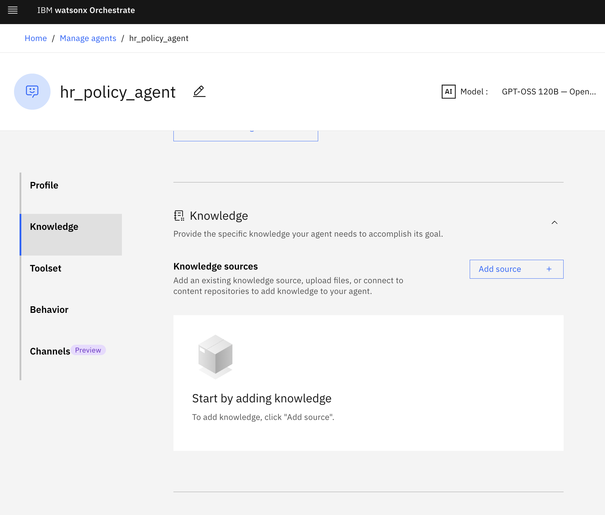
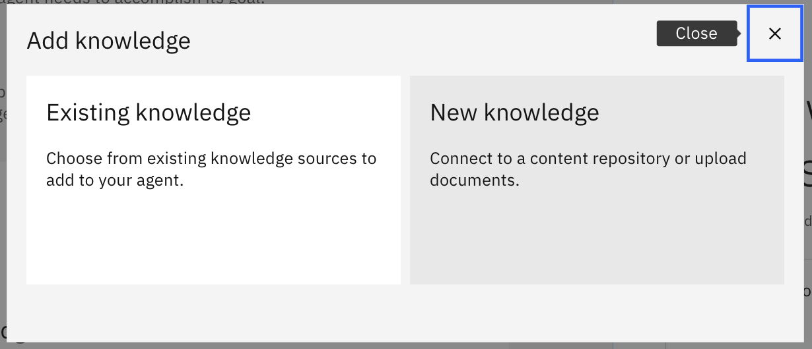
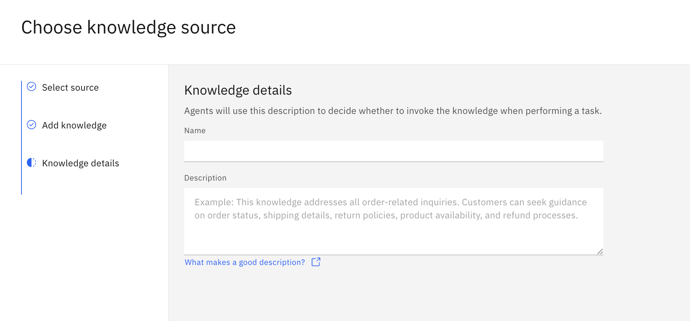

1. go to hamburger menu on the top right, then 'Build'
2. click on 'Create agent' 
3. select 'Create from scratch'
4. Nmae you agent `[]` and description ```[]```
5. scroll down to knowledgebase section  and click 'Add source' then 'New knowledge' and add 3 file from the `policy` folder
6. in knowledge detail ```[]``` and knowledge name ```[]```
6. add behaviour ```[]```
7. try asking the following question
เอกสาร 1: นโยบายความเป็นส่วนตัว (HR-PL-001)

บริษัทเก็บรักษาข้อมูลส่วนบุคคลของพนักงานไว้นานเท่าใดหลังพ้นสภาพการเป็นพนักงาน?
เจ้าของข้อมูลส่วนบุคคลมีสิทธิอะไรบ้างตามนโยบายนี้?
หากเกิดเหตุการละเมิดข้อมูลส่วนบุคคล พนักงานต้องรายงานต่อ DPO ภายในกี่ชั่วโมง และบริษัทต้องแจ้ง สคส. ภายในกี่ชั่วโมง?
ใครเป็นผู้รับผิดชอบดูแลข้อมูลส่วนบุคคลของพนักงานและผู้สมัครงาน?
นโยบายนี้จะได้รับการทบทวนบ่อยแค่ไหน?

เอกสาร 2: นโยบายความมั่นคงปลอดภัยด้านเทคโนโลยีสารสนเทศ (HR-IT-002)

รหัสผ่านของพนักงานต้องมีความยาวขั้นต่ำกี่ตัวอักษร และต้องเปลี่ยนทุกกี่วัน?
ระบบจะล็อกบัญชีผู้ใช้โดยอัตโนมัติเมื่อพบการเข้าสู่ระบบผิดพลาดกี่ครั้ง?
เหตุการณ์ระดับ "วิกฤต (Critical)" ต้องได้รับการตอบสนองภายในระยะเวลาเท่าใด?
การเข้าถึงระบบภายในจากภายนอกต้องผ่านช่องทางใด?
ช่องโหว่ที่มีความเสี่ยงระดับวิกฤตต้องได้รับการแก้ไขภายในกี่วัน?

เอกสาร 3: นโยบายแผนการสืบทอดตำแหน่ง (HR-TM-003)

เครื่องมือใดที่ใช้ในการประเมินศักยภาพผู้สมัครเป็นผู้สืบทอดตำแหน่ง?
ระดับความพร้อม "Ready Now" หมายถึงอะไร?
ใครเป็นผู้อนุมัติแผนสืบทอดตำแหน่งสำหรับตำแหน่งผู้บริหารระดับสูง?
แผนสืบทอดตำแหน่งมีกี่ขั้นตอน และขั้นตอนแรกคืออะไร?
ข้อมูลผลการประเมินและรายชื่อผู้สืบทอดตำแหน่งต้องถูกจัดการอย่างไรเพื่อรักษาความลับ?