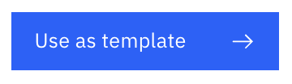
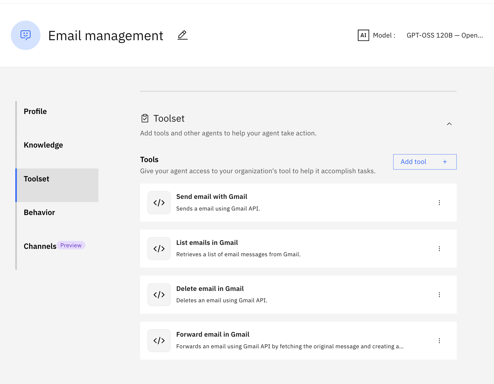

1. do to `Discovery` page, search for `google` pre-built agent 
2. choose "Email manager"
3. click use tamplate
3. scroll down to the tools section and you will see the prebuild tools
4. click on three dot next to the tools > Edit details. then you will see that the connection have already been configured 


try the following prompt:

```
send email to <your email> with 
topic: Your dental appointment
content: we have already scheduled your appointment
```

